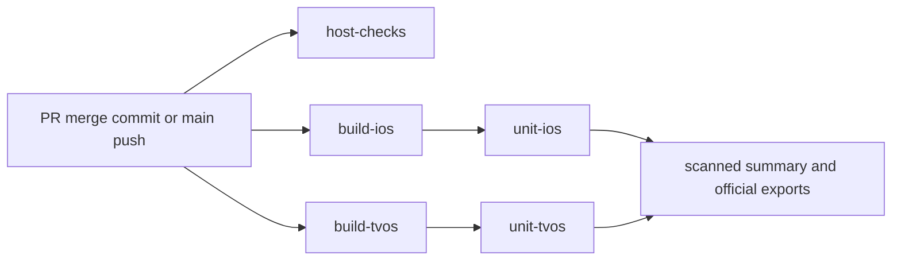

# Unit tests from the build archive

`ci-gate` runs the complete `immichSlidesTests` target on the pinned iPhone and Apple TV.
Each consumer uses the [build archive](CI_BUILD_ARCHIVE.md), immutable artifact-ID
selection and manifest checks. It removes its source checkout before enumeration and
execution, with no project, scheme, package checkout or rebuild available.

## Job graph and limits



Each unit job waits only for its own platform's build. The critical path is the longer
complete platform path or host checks; queue time is measured separately.
Both build and consumer jobs are bounded at 40 minutes. Builds have a 30-minute script
bound. Unit consumers have separate boot, enumeration and execution bounds:

| Phase | CI iOS | CI tvOS | Local default |
| --- | ---: | ---: | ---: |
| Simulator boot (`simctl bootstatus -b`) | 240 s | 240 s | 600 s |
| Bundle enumeration, after boot | 660 s | 300 s | 300 s |
| Unit execution | 900 s | 900 s | 900 s |
| Official tests / summary exports | 60 / 60 s | 60 / 60 s | 60 / 60 s |
| Owned simulator shutdown / delete | 15 / 60 s | 15 / 60 s | 15 / 60 s |

There is no automatic test retry or silent rebuild. The [trusted publisher](https://github.com/sudoHG/immichSlides/issues/89)
owns the `ci-pr-gate` status and required-status enforcement. A failing unit test fails
the producer job; a job conclusion alone is not evidence of that trusted status.

## Execution and records

Selection and identity checks precede tooling staging. The consumer removes its entire
checkout, extracts to another absolute path, rejects existing build-time source and
Products paths, and remeasures `Signature=adhoc`. Device type, runtime and Xcode build
come from `scripts/ci-pins.json`. Signing stays **Sign to Run Locally**, clone-process
parallelism is disabled, and automatic simulator diagnostic collection is disabled.
Official function/parameter results and failures are still exported.

```sh
python3 -B scripts/ci_build_archive.py select --platform ios \
  --artifact-id ID --producer-attempt ATTEMPT --selection-path /tmp/archive-selection.json \
  --output-dir /tmp/unit-records
python3 -B scripts/ci_unit_tests.py stage --path /tmp/archive-tools
# In CI, remove the disposable checkout after selection and staging.
python3 -B /tmp/archive-tools/scripts/ci_unit_tests.py run \
  --selection-path /tmp/archive-selection.json --archive-dir /tmp/archive-download \
  --relocated-path /tmp/consumer-relocated-ios --output-dir /tmp/unit-records \
  --enumeration-profile ci
python3 -B /tmp/archive-tools/scripts/ci_unit_tests.py scan --output-dir /tmp/unit-records
```

Use fresh paths and `tvos` selection for Apple TV. Artifact selection requires CI event
metadata and an actions-read token. `--simulator-id <UDID>` selects an existing matching
simulator; otherwise the consumer creates and deletes its own pinned device. Local
archive experiments use real local identity and a null artifact ID, never an invented
GitHub artifact ID. Local runs require 80 GiB free before each Xcode invocation;
hosted runs retain the 30 GiB reserve.

Enumeration and execution use `xcodebuild test-without-building -xctestrun ...` with
`-only-testing:immichSlidesTests`, dedicated DerivedData and private result paths.
No unit identity is deselected. Enumeration errors fail even on process exit zero.
Empty/duplicate identities, missing/extra execution, unparseable results, disagreeing
official counts and failing parameter runs fail the consumer. Compilation is compared
with execution; independent source declarations use the [population library](CI_POPULATION.md).
Until unit integration, `declared` remains empty.

The official overall `result` is classified with the offline runner's rules.
`Failed` fails even when function counts look successful; unknown overall results
cannot pass. Otherwise successful results with skips remain `unverified`, using
`policy-proposed`, a non-infrastructure `Policy` diagnostic. No expected skip is
approved or applied by this consumer. Exception proposals belong in the PR body.
The current policy has a single file-level `approval_state`; it cannot represent
approved host exceptions and proposed unit exceptions separately. Unit integration
requires a maintainer decision between per-tier approval state and a separate unit
policy file. The consumer does not change the schema or the approved host policy.

The [summary contract](CI_SUMMARY.md) keeps successful Swift rows in JSON and displays
failures/skips in Markdown. Parameter rows retain official arguments and outcomes.
Skip reasons preserve the exact emitted `Skip Message`, including generic `Test skipped`.
Failed functions and parameters retain the first official `Failure Message` line,
capped at 200 characters. Plain assertion failures do not add infrastructure entries;
timeouts, unavailable results and export failures remain infrastructure failures.

`archive-consumption.json` precedes Xcode and records artifact ID, producer run/attempt,
consumer attempt, identity, archive/manifest hashes, signing, source/Products absence,
process exits and official export hash. `bundle-enumeration.json`, `official-tests.json`
and `official-summary.json` preserve independent enumeration, outcomes and counts.
Archive validation failures reuse `archive-identity-mismatch` or `archive-unavailable`
with **use Re-run all jobs**. Simulator/enum failures use `unit-archive-failed`.

Raw bundles stay outside publishable records in the existing private-result storage.
Finalization attempts official export even after Xcode failure, with separate
60-second bounds for tests and summary. Execution exits other than 0 or 65 record
`unit-execution-timed-out` (124) or `unit-execution-failed` before result comparison.
An export timeout records `unit-results-timed-out`. Owned-simulator shutdown and delete
have 15- and 60-second bounds; deletion still runs after shutdown failure. Their durations
and exit codes are measured. Cleanup failure makes the summary failed, and scanning
continues. Failed runs or
export/scan errors retain a private quarantine record; successful export and sensitive
scan precede disposal. A failed enumeration attempts export and retains both process
exits and archive identity, even when no executable test results exist.

An independent `always()` scan runs after the consumer, including when preflight,
selection, download or staging failed, or execution failed before saving its own failed
record. It reuses the sensitive scanner
through the system Python without requiring a completed environment setup or units step.
Failed steps require a `unit-<platform>` failed record. Earlier selection records are
relabeled, and otherwise successful records become classified failures with rerun advice;
an existing failed unit record keeps its original diagnostic and official evidence.
Artifact and step-summary publication require
this scan's `records_safe` output. No records produces **Unit records were not produced;
publication is unavailable.** A refused scan produces only **Unit record scanning refused
publication.** Neither case prints raw diagnostics. Relocated-product cleanup is a
separate `always()` step. The upload allowlist contains only compact records and official
exports; raw bundles, logs, screenshots, activities and quarantine paths never upload.
Records expire after 30 days for PRs and 7 days for other runs.

## Measurements and budgets

Workflow timestamps measure setup and transfer. Monotonic clocks measure build,
packing, separate simulator boot, post-boot enumeration, execution and consumer total.
Producer/consumer disk tracers sample free volume space every second, retaining minimum
free space and peak growth. These shared-volume samples include transient simulator
files and other activity; they are not estimates from final Products size. Queue times
come from workflow-created and job-start timestamps; a unit queue starts after its own
build completes. Full per-run measurements and acceptance history belong in PR records.

`--enumeration-profile ci` uses [post-boot calibration](https://github.com/sudoHG/immichSlides/actions/runs/37716498397):
iOS 307.10 s and tvOS 41.62 s. Nearest-rank sample p95, a **2x margin**, upward rounding
to whole minutes and a 300-second floor choose **660 / 300 s**. Omitting the profile
keeps the local 300-second default. Only completed measurements are used. The small
calibration set does not estimate population tail latency or prove capacity.

The [recovery calibration](https://github.com/sudoHG/immichSlides/actions/runs/37717972490)
measured maximum boot at **110.19 s**; 2x and upward minute rounding choose **240 s**.
Its iOS job lasted 556 s, with 110.19 + 251.28 + 70.47 s in the three phases, leaving
**124.06 s** measured job overhead. Adding separate 60-second tests and summary export
bounds, plus 15 seconds for simulator shutdown and 60 seconds for delete, and rounding upward
gives a conservative **360-second overhead allowance**. A hosted delete exceeded its
former 15-second bound; the 60-second recovery allowance remains bounded. The runner's shared
interrupt grace is **120 s**. The longest combined bound is therefore
`240 + 660 + 900 + 120 + 360 = 2280 s < 2400 s`.
The guard reads actual workflow `timeout-minutes`; measurements and Markdown record
phase limits, grace, measured overhead and allowance. These are infrastructure budgets;
product assertions and success thresholds do not change.

The provisional feedback budget is **72 minutes (4320 s)**. The method uses
nearest-rank sample p95 across completed hosted success and failure paths, including
queueing through the last completed job, a **1.5x margin** and upward minute rounding.
The [recovery measurement](https://github.com/sudoHG/immichSlides/actions/runs/37741604879)
of 2876 s establishes a conservative floor: `ceil(2876 * 1.5 / 60) = 72`, leaving
1444 s above that observation. Final-configuration paired measurements and the retained
margin are published with [the consumer PR](https://github.com/sudoHG/immichSlides/pull/131).
This budget is **provisional until #93 promotion**. Enforcement belongs to #89;
concurrent PR/nightly capacity and the promotion sample remain unverified.
Script/job timeouts are cancellation bounds, not promises of runner capacity.
