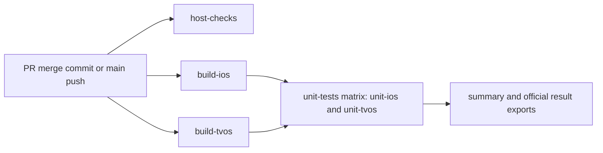

# Unit tests from the build archive

`ci-gate` runs the entire `immichSlidesTests` target on the pinned iPhone and Apple TV.
Each consumer uses the [existing build archive](CI_BUILD_ARCHIVE.md), artifact-ID
selection and full manifest checks. It has no app source checkout, project, scheme,
package checkout or build step. The temporary five-test relocation proof is removed.
Host/privacy jobs, App behavior, assertions and test-plan membership are unchanged.

## Job graph and bounds



Host checks, iOS build and tvOS build start independently. The unit matrix waits for
both builds, uses at most two hosted runners, and does not fail-fast across platforms.
The critical path is the longer build plus the longer consumer, with queue time
reported separately. Script bounds are 30 minutes for a build and 15 minutes for
unit execution. CI enumeration uses the measured profile below: 10 minutes on iOS
and 5 minutes on tvOS; the local default remains 5 minutes on both. Job bounds are
40/35 minutes, leaving 10 minutes beyond the longest combined consumer script phases
for setup, interruption grace, official exports, upload and cleanup. There is no
automatic test retry or silent rebuild.

The publisher in [#89](https://github.com/sudoHG/immichSlides/issues/89) owns the future
trusted `ci-pr-gate` status. This producer does not create it, set a required status,
approve a policy or implement a trusted verdict. A failing unit test fails the job
and the workflow, and its official results remain available in the compact records.

## Execution and records

Checkout identity and artifact selection run before staging tooling. The consumer
then removes its entire checkout, extracts to another absolute path, checks that
build-time source and Products are absent, and measures `Signature=adhoc` again.
The device type, runtime and Xcode build come from `scripts/ci-pins.json`.
Consumer simulators disable clone-process parallelism; signing stays **Sign to Run Locally**.
Automatic simulator diagnostic collection is disabled, as in the strict runner;
official function/parameter results and failures are still exported.

The shared entry points are:

```sh
python3 -B scripts/ci_build_archive.py select --platform ios \
  --artifact-id ID --producer-attempt ATTEMPT --selection-path /tmp/archive-selection.json \
  --output-dir /tmp/unit-records
python3 -B scripts/ci_unit_tests.py stage --path /tmp/archive-tools
# In CI, remove the disposable checkout after selection and staging.
python3 -B /tmp/archive-tools/scripts/ci_unit_tests.py run \
  --selection-path /tmp/archive-selection.json --archive-dir /tmp/archive-download \
  --relocated-path /tmp/consumer-relocated-ios --output-dir /tmp/unit-records \
  --enumeration-profile ci
```

Use fresh paths and `tvos` selection for Apple TV. Local verification uses the
workspace watchdog/device-slot wrappers and `--simulator-id <assigned-UDID>`; no
other simulator is created, changed or deleted. Artifact selection requires CI
event metadata and an actions-read token in the environment. Local archived-build
experiments use a temporary selection record derived from that build's real local
identity; their artifact ID is null, never an invented GitHub ID. The future local
reproduction ticket owns a complete local build-and-select entry point.

Both enumeration and execution call `xcodebuild test-without-building -xctestrun ...`
with `-only-testing:immichSlidesTests`, a dedicated DerivedData path and private
result path. No unit test is deselected. Enumeration errors are rejected even if
Xcode exits zero. Empty/duplicate identities, missing/extra execution, unparseable
results, disagreeing official counts and failing parameter runs fail the consumer.
The 05b cross-check is compiled versus observed; independent static declarations
belong to [#130](https://github.com/sudoHG/immichSlides/pull/130), so `declared` stays
empty rather than relabeling compilation as source enumeration.

The consumer writes the existing [summary contract](CI_SUMMARY.md). Successful Swift
rows stay in JSON; Markdown displays failures and skips. Parameter runs retain
their official argument identity and outcome under the function-level identity.
Exact `Skip Message` diagnostics are retained, including Xcode's generic `Test skipped`.

`archive-consumption.json` is written before Xcode and updated after export. It records
artifact ID, producer run/attempt, consumer attempt, full identity, manifest/archive
hashes, signing measurement, source/Products absence, process exit and official export
hash. `bundle-enumeration.json`, `official-tests.json` and `official-summary.json`
preserve the independent enumeration, function/parameter outcomes and official counts.
`measurements.json` records setup, transfer, enumeration, test and total seconds.
Producer records add setup/build/pack timings and sampled disk use.

Raw results use the existing owner-only private result-bundle helpers from the strict
runner, outside publishable records. Finalization exports official results even after
Xcode failure. A failed enumeration also attempts official export and quarantines
its private bundle when export is unavailable; records distinguish enumeration from
execution and retain both process exits. Successful export, record writing and the unchanged sensitive scan
precede disposal; failed runs or export/scan errors retain the private bundle with a
quarantine record. Upload uses an explicit compact-file allowlist and a successful
sensitive-scan output. Raw bundles, activities, logs, screenshots and quarantine paths
are never uploaded. Records expire after 30 days for PRs and 7 days for other runs.

## Measurements and budget

Setup and transfer are measured by workflow timestamps around their steps. Build,
packing, enumeration and execution use monotonic clocks. Producer and consumer disk
tracers sample free volume space every second, recording minimum free space and peak
growth from the start. Growth includes transient simulator/Xcode files and other
activity on the same volume; it is not an estimate from final Products size alone.
Local runs require 80 GiB before every Xcode invocation. Hosted runs retain the
existing 30 GiB allowance and record the reserve. Queue measurements come from
GitHub's run-created and job-start timestamps, separately from job execution.

The explicit `--enumeration-profile ci` budget is computed from hosted observations
in the consumer; omitting it keeps the local 300-second default. iOS completed
enumeration in 166.58 seconds ([initial run](https://github.com/sudoHG/immichSlides/actions/runs/37705159130))
and 293.18 seconds ([negative attempt 2](https://github.com/sudoHG/immichSlides/actions/runs/37706340184)).
Two other iOS runs were interrupted at 300 seconds; their observed wall durations
were 352.58 and 304.47 seconds including shutdown grace, which are **not** completed
enumeration durations. These right-censored samples make the nearest-rank sample
p95 only a lower bound of 300 seconds. A 2x margin (100% above that bound), rounded
up to whole minutes with a 300-second minimum, selects **600 seconds** for CI iOS.
tvOS completed in 63.16, 95.22 and 89.32 seconds, so the same rule retains 300 seconds.
The small, censored sample does not estimate the true tail latency or prove capacity.

`measurements.json` records the completed/censored samples, p95 lower bound, margin,
chosen enumeration bound, unchanged 900-second execution bound and 2100-second job
bound; the job's Markdown summary presents the same decision. The longest combined
script phase bounds are 1500 seconds, shorter than the job's 2100 seconds. This is
an infrastructure timeout decision; no product assertion or success threshold changes.

Measured hosted timings, queue values, disk samples and the resulting proposed gate
budget are published in the PR with run links. These initial samples do not prove
latency under overlapping PR/nightly load; that capacity acceptance remains with the
later UI tracer and publisher tickets. Workflow bounds are cancellation limits, not
a passing gate or a promise of reserved capacity.

Initial hosted sample: [run 37705159130](https://github.com/sudoHG/immichSlides/actions/runs/37705159130),
head `a8fd257`, merge `2b61062`, tree `6bd06c2`, producer/consumer attempt 1.
Both unit jobs succeeded; function results were iOS 618 passed + 19 skipped and
tvOS 616 passed + 18 skipped, with 41 parameter outcomes on each platform.
Both producer summaries remain `unverified` for the unapproved skips.

| Phase / measurement | iOS | tvOS |
| --- | ---: | ---: |
| Producer setup | 13 s | 11 s |
| Build-for-testing | 168.93 s | 148.07 s |
| Archive packing | 16.41 s | 16.13 s |
| Consumer setup | 13 s | 14 s |
| Archive download | 1 s | 4 s |
| Bundle enumeration | 166.58 s | 63.16 s |
| Unit execution | 147.33 s | 91.33 s |
| Consumer total, excluding setup/download | 323.46 s | 164.01 s |
| Build runner queue, from workflow creation | 7 s | 52 s |
| Consumer runner queue, after both builds completed | 51 s | 294 s |
| Producer peak volume growth / minimum free | 1.32 / 37.48 GiB | 1.30 / 37.63 GiB |
| Consumer peak volume growth / minimum free | 2.65 / 36.15 GiB | 1.98 / 36.84 GiB |

GitHub job timestamps give 12 minutes 10 seconds from workflow creation to the last
completed job, including queueing. The initial gate feedback budget is **20 minutes**,
providing 7 minutes 50 seconds of headroom above this observed sample. The script/job
timeouts remain larger failure-recovery bounds, not this latency target. Enforcement
and admission by the trusted publisher remain #89's responsibility. Do not promote
the gate from one sample; concurrent PR/nightly capacity remains unmeasured.

## Proposed unit skip policy

[`scripts/ci-unit-skip-proposal.json`](../scripts/ci-unit-skip-proposal.json) is a
separate **proposed** inventory, not the unmerged `scripts/ci-test-policy.json` policy
from #130. Neither workflow nor consumer reads or applies this proposal. No agent
approval is performed; the maintainer must approve the exact entries before they
become trusted expected-skip or deselection policy.

Each entry records its exact measured identity/reason, platform and unit/hermetic
scope; the table below records conditions and proposed owners. Generic `Test skipped` is a real measured diagnostic,
not proof that the proposed source condition was the cause. Until approved,
otherwise successful execution with any skip returns process exit 0 but producer
status **unverified**, with `unit-skips-unapproved`. Actual failures, omissions,
export errors and timeouts remain nonzero failures. There are no active deselections
and no wildcard that silently covers a future test.

Baseline `36f3655` has 21 conditional attributes in six unit files: three suite traits
and 18 test traits, plus the shared Evidence switch. This reconciles the review's
approximate 23-site backlog without treating attribute sites as test identities.
The actual compiled/executed population contains 19 skipped functions on iOS and
18 on tvOS; the iOS-only EXIF performance function explains the difference.

| Suite | Skips iOS / tvOS | Measured reason | Proposed condition / owner |
| --- | ---: | --- | --- |
| ExifForegroundAnalyzerPerformanceIOSTests | 1 / 0 | `Test skipped` | Evidence switch unset; nightly offline performance |
| FaceBoxLiveProbeTests | 1 / 1 | `Test skipped` | Evidence and live configuration absent; nightly live probes |
| PerformanceLiveIntegrationTests | 3 / 3 | `Test skipped` | Evidence and live configuration absent; nightly live performance |
| PlaybackPoolResolverLiveIntegrationTests | 6 / 6 | `Test skipped: No local live config; a skip does not mean live membership was verified` | Live configuration absent; nightly live unit tests |
| PlaybackRuntimeEvidenceManifestTests | 1 / 1 | `Test skipped` | External runtime JSONL input absent; manually collected runtime evidence |
| SlideShowViewModelLiveIntegrationTests | 7 / 7 | Six `Test skipped`; one `Test skipped: No local live config; a skip does not mean live dedup was verified` | Live configuration absent; nightly live unit tests |

The proposal follows #130's entry shape but stays in a separate file. These owners
describe where the coverage belongs; they do not declare a nightly tier in scope or
claim that it has executed. The exact 37 entries are also presented in the PR body
for approval; the empty deselection list means every compiled unit identity still runs.
